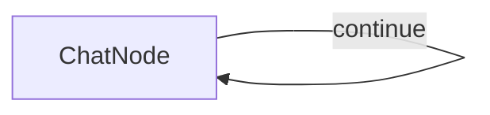

#  Simple PocketFlow Chat with Ollama & Llama 3.2

A basic chat application using PocketFlow with Ollama's Llama 3.2 model running locally.

## Features

- Conversational chat interface in the terminal
- Maintains full conversation history for context
- Uses locally-running Llama 3.2 via Ollama (no API keys required)
- Simple implementation demonstrating PocketFlow's node and flow concepts

## Prerequisites

1. Install Python requirements:
    ```bash
    pip install -r requirements.txt
    ```

2. Choose your LLM provider and set it up:

### Option 1: Ollama (Default - Local, Free)
```bash
# Download from https://ollama.ai
ollama pull llama3.2
# Ollama server runs on http://localhost:11434 by default
```

### Option 2: OpenAI
```bash
export LLM_PROVIDER="openai"
export LLM_MODEL="gpt-4o"
export OPENAI_API_KEY="your-api-key"
```

### Option 3: Anthropic
```bash
export LLM_PROVIDER="anthropic"
export LLM_MODEL="claude-3-5-sonnet-20241022"
export ANTHROPIC_API_KEY="your-api-key"
```

### Option 4: Azure OpenAI
```bash
export LLM_PROVIDER="azure"
export LLM_MODEL="gpt-4"
export AZURE_API_KEY="your-api-key"
export AZURE_ENDPOINT="https://your-resource.openai.azure.com/"
```

## Run It

Simply run the chat application:
```bash
python main.py
```

The application will use the configured LLM provider and model. By default, it uses Ollama with Llama 3.2.

### Environment Variables

- `LLM_PROVIDER`: Provider name (ollama, openai, anthropic, azure) - default: ollama
- `LLM_MODEL`: Model identifier - default: llama3.2:3b
- `LLM_API_KEY`: API key (required for OpenAI, Anthropic, Azure)
- `LLM_BASE_URL`: Custom API endpoint (optional)
- `OPENAI_API_KEY`: OpenAI API key (alternative to LLM_API_KEY)
- `ANTHROPIC_API_KEY`: Anthropic API key (alternative to LLM_API_KEY)
- `AZURE_API_KEY`: Azure API key (alternative to LLM_API_KEY)
- `AZURE_ENDPOINT`: Azure endpoint URL

## How It Works



The chat application uses:
- A single `ChatNode` with a self-loop that:
  - Takes user input in the `prep` method
  - Sends the complete conversation history to Llama 3.2 (via Ollama)
  - Adds responses to the conversation history
  - Loops back to continue the chat until the user types 'exit'


## Files

- [`main.py`](./main.py): Implementation of the ChatNode and chat flow
- [`utils.py`](./utils.py): Wrapper for calling Llama 3.2 via Ollama
 